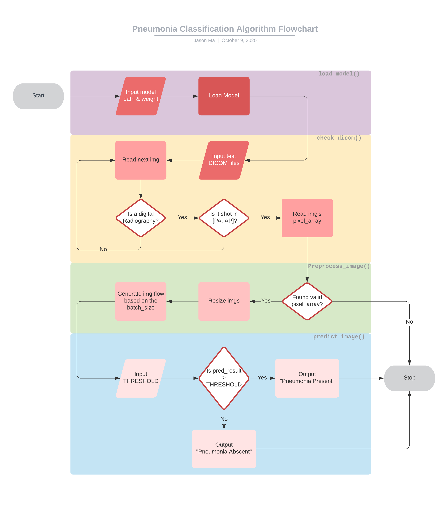
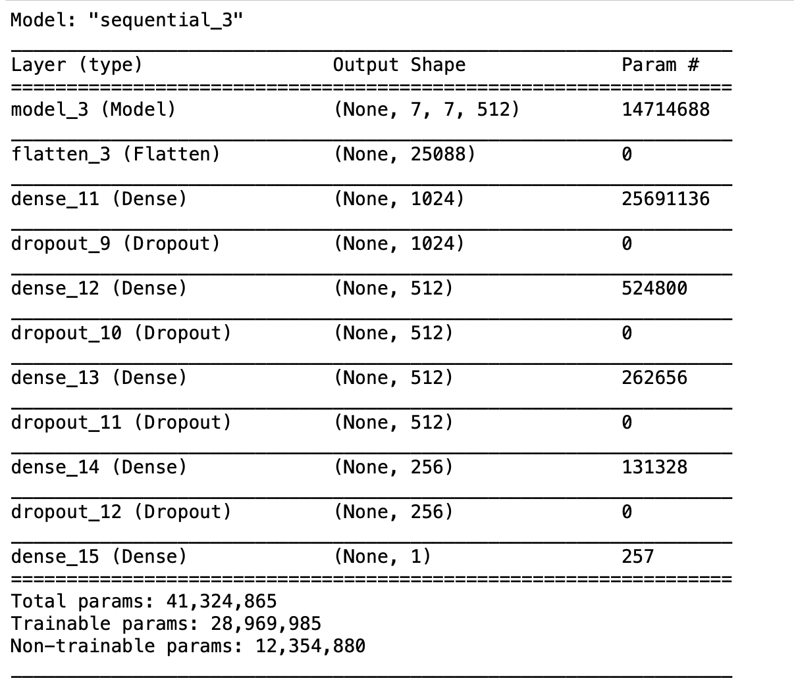
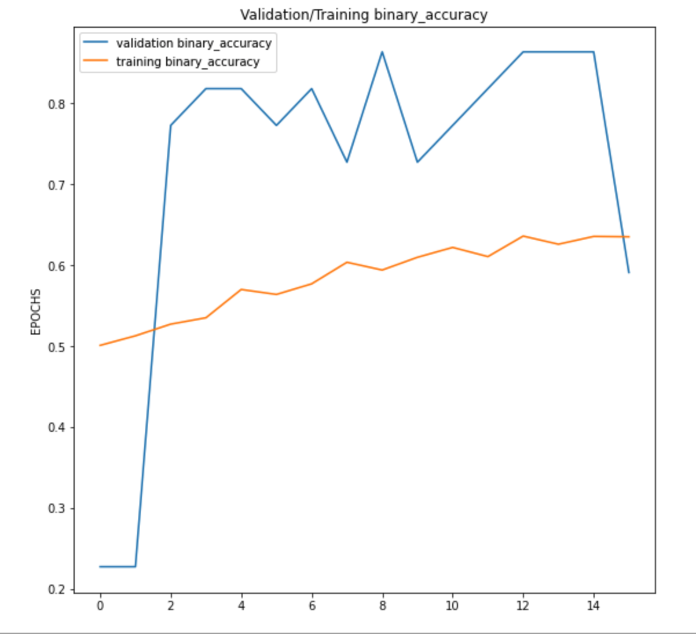
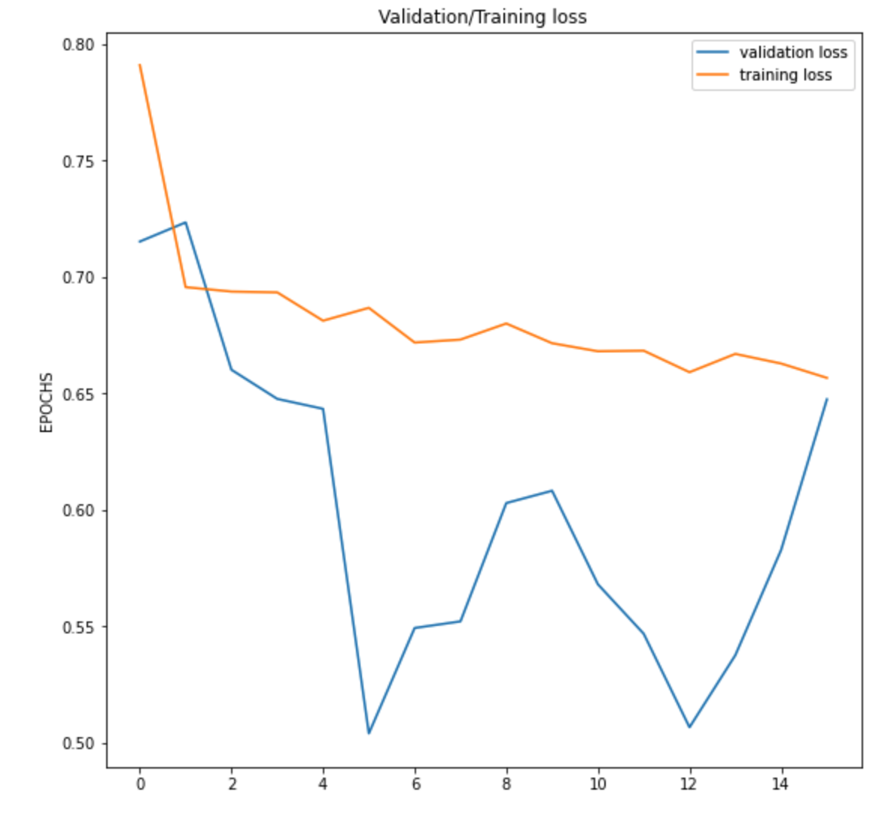
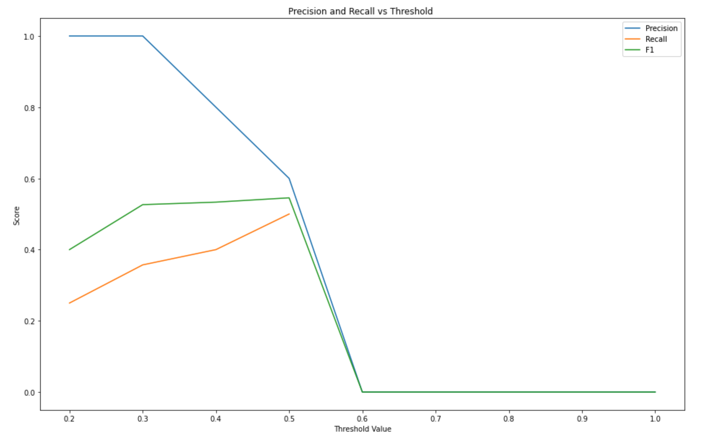
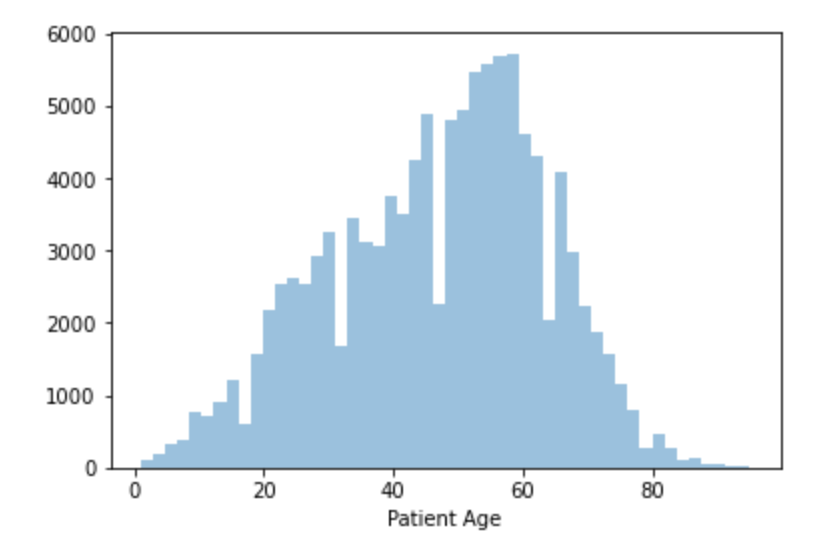
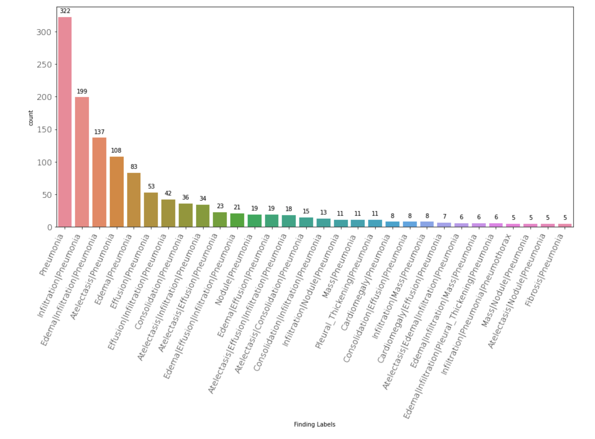
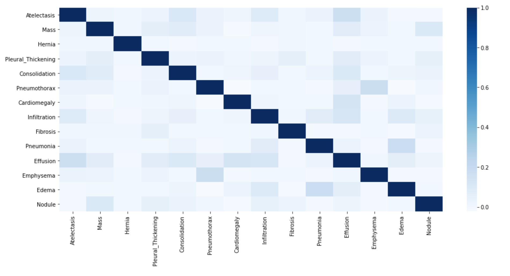
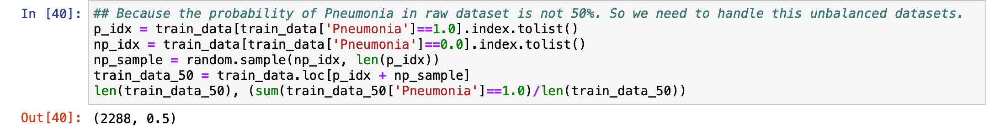
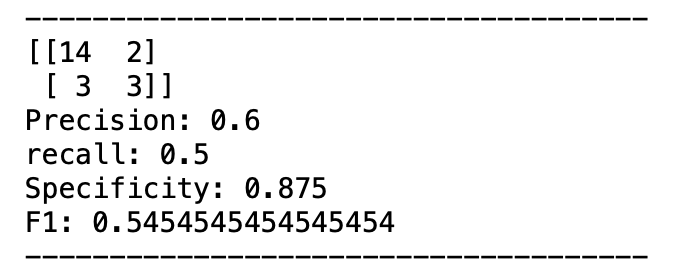

# FDA  Submission

**Your Name:**
Zhicheng Ma

**Name of your Device:**
Pneumonia Detection Algorithm
## Algorithm Description 

### 1. General Information

**Intended Use Statement:** 

As a CADx devide to assist the radiologist in the detection of Penumonia.

**Indications for Use:**

The algorithm is indicated to used for people from 1 to 95 years old who have taken an Xray image in AP or PA position.

**Device Limitations:**

The algorithm does not work for people under 1-year-old or beyond 95 years old. The algorithm only works for Xray images were taken by AP or PA position.
The algorithm provides a high specificity which is 0.875 and the recall is 0.5. That indicates the algorithm rarely made mistake in False Positive.
So, if the algorithm said a patient has Pneumonia, the patient has a great chance of having Pneumonia.

### 2. Algorithm Design and Function

	>

>

**DICOM Checking Steps:**

1. This DICOM is a digital radiography or not?
2. This DICOM is shot in [PA, AP] or not?

**Preprocessing Steps:**

1. Initial a new ImageGenerator
2. Resize images
3. Generate img flow based on the batch_size 

**CNN Architecture:**

	

>

### 3. Algorithm Training

**Parameters:**
* Types of augmentation used during training
* Batch size
* Optimizer learning rate
* Layers of pre-existing architecture that were frozen
* Layers of pre-existing architecture that were fine-tuned
* Layers added to pre-existing architecture

* Type of augmentations:

	rotation,
	width_shift_range,
	height_shift_range,
	shear_range,
	zoom_range,
	rescale

* Batch_size:

	32

* Optimizer learning rate:

	0.001

* Layers of pre-existing architecture that were frozen:

	[:-2]

* Layers of pre-existing architecture that were fine-tuned:

	[-2: ]

* Layers added to pre-existing architecture:

	1. Flatten Layer
	2. Dense Layer (1024)
	3. Dropout Layer(0.5)
	4. Dense Layer (512)
	5. Dropout Layer (0.5)
	6. Dense Layer (512)
	7. Dropout Layer (0.5)
	8. Dense Layer (0.5)
	9. Output Layer (1)

	
	
	

**Final Threshold and Explanation:**

As the P-R plot above, I take 0.5 as my threshold. It is the most balanced value for Precision, Recall, and F1 score.

### 4. Databases
 (For the below, include visualizations as they are useful and relevant)

The dataset include people aged from 1 to 95.

	

Including diseases:

	

And the corrlations among these diseases:

	

**Description of Training Dataset:** 

Contains 2288 rows of valid data, 1144 valid data contains Penumonia.

	

**Description of Validation Dataset:** 

Contains 1430 rows of valid data, 286 valid data contains Pneumonia.

### 5. Ground Truth

Labeled by experienced radiologists.

### 6. FDA Validation Plan

**Patient Population Description for FDA Validation Dataset:**

**The ideal dataset would be: **
* Age Range: 1 - 95
* Gender Distribution: Male : Female = 1.41 : 1
* Imaging Modality: Digital Radiography
* Body Parts Examined: Chest
* Prevalence of Pneumonia: 20% patients contain Pneumonia among the total testing dataset.
* Other Diseases Distribution: As the plot below:

	

 

**Ground Truth Acquisition Methodology:**

Voting system across several radiologists OR weighted across several radiologists' training levels.

**Algorithm Performance Standard:**

Using F1 score as algorithm performance standard.
The performance standard of the algorithm oriented from a paper1 post in 2017 is 0.387.
The performace of my algorithm is: 

	

>

**References**

Pranav Rajpurkar, Jeremy Irvin, Kaylie Zhu, Brandon Yang, Hershel Mehta, Tony Duan, Daisy Ding, Aarti Bagul, Robyn L. Ball, Curtis Langlotz, Katie Shpanskaya, Matthew P. Lungren, Andrew Y. Ng. CheXNet: Radiologist-Level Pneumonia Detection on Chest X-Rays with Deep Learning. *arXiv:1711.05225v3 [cs.CV] 25 Dec 2017*
